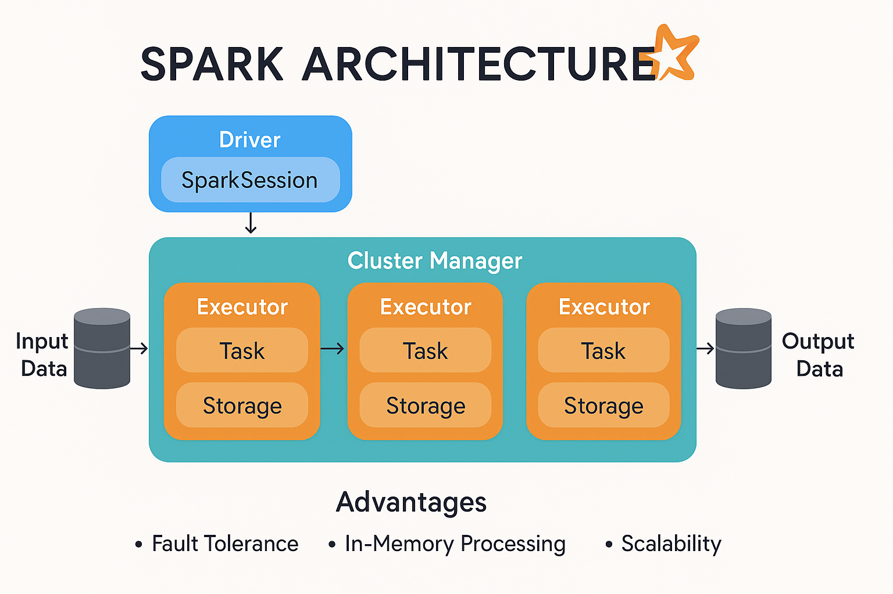
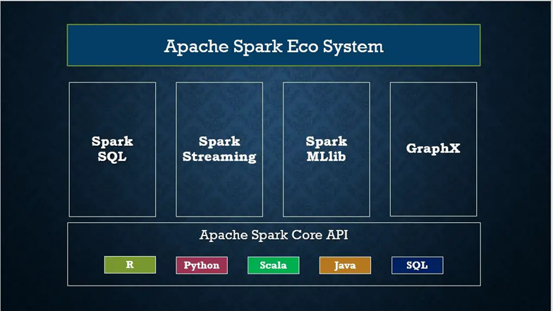

# Basics of spark

---
### What is spark..?
Apache Spark (Spark) is an open-source data-processing engine for large data sets.

### Features of spark
1. 	**Fault tolerance** : Apache Spark is designed to handle worker node failures. It achieves this fault tolerance by using DAG(Directed acyclic graph) and RDD (Resilient Distributed Datasets)
2.	**Dynamic In Nature** : Spark offers over 80 high-level operators that make it easy to build parallel apps.
3.	**Lazy Evaluation** : Spark does not evaluate any transformation immediately. All the transformations are lazily evaluated
4.	**Real-Time Stream Processing** : Spark Streaming brings Apache Spark's language-integrated API to stream processing, letting you write streaming jobs the same way you write batch jobs.
5.	**Speed** : Spark enables applications running on Hadoop to run up to 100x faster in memory and up to 10x faster on disk.
6.	**Reusability** : Spark code can be used for batch-processing, joining streaming data against historical data as well
7.	**Advanced Analytics** : Spark provides both machine learning and graph processing libraries, which companies across sectors leverage to tackle complex problems.
8.	**In Memory Computing** : Apache Spark is capable of processing tasks in memory, and it is not required to write back intermediate results to the disk.
9.  **Supporting Multiple languages** : It has most of the APIs available in Java, Scala, Python and R.
10.	**Integrated with Hadoop** : Apache Spark integrates very well with Hadoop file system HDFS. It offers support to multiple file formats like parquet, json, csv, ORC, Avro etc.
11.	**Cost efficient** : Apache Spark is an open source software, so it does not have any licensing fee associated with it.

### Appache spark addvanatges
*	Spark is a general-purpose, in-memory, fault-tolerant, distributed processing engine that allows you to process data efficiently in a distributed fashion.
* 	Applications running on Spark are 100x faster than traditional systems.
*	You will get great benefits using Spark for data ingestion pipelines.
*	Using Spark we can process data from Hadoop HDFS, AWS S3, Databricks DBFS, Azure Blob Storage, and many file systems.
*	Spark also is used to process real-time data using Streaming and Kafka.
*	Using Spark Streaming you can also stream files from the file system and also stream from the socket.
*	Spark natively has machine learning and graph libraries.
*	Provides connectors to store the data in NoSQL databases like MongoDB.
### Spark architecture

Apache Spark works in a master-slave architecture where the master is called “Driver” and slaves are called “Workers”. When you run a Spark application, Spark Driver creates a context that is an entry point to your application, and all operations (transformations and actions) are executed .
### Cluster Manager Types
Spark supports below cluster managers
* **Standalone** – a simple cluster manager included with Spark that makes it easy to set up a cluster.
* **Apache Mesos** – Mesos is a Cluster manager that can also run Hadoop MapReduce and Spark applications.
*	**Hadoop YARN** – the resource manager in Hadoop 2. This is mostly used, cluster manager.
*	**Kubernetes** – an open-source system for automating deployment, scaling, and management of containerized applications.
*	**local** – which is not really a cluster manager but still I wanted to mention as we use `“local”` for `master()` in order to run Spark on your laptop/computer.

### Spark Ecosystem

* **SPARK SQL** : Is used to run SQL query using distributed engine
* **Spark Streaming** : Access live data streams using kafka, Spark uses Micro-batching for real-time streaming.
* **Spark MLlib** :  It contains machine learning libraries that have an implementation of various machine learning algorithms. 
* **Spark GraphX** : It is network graph analytics engine and data store. 